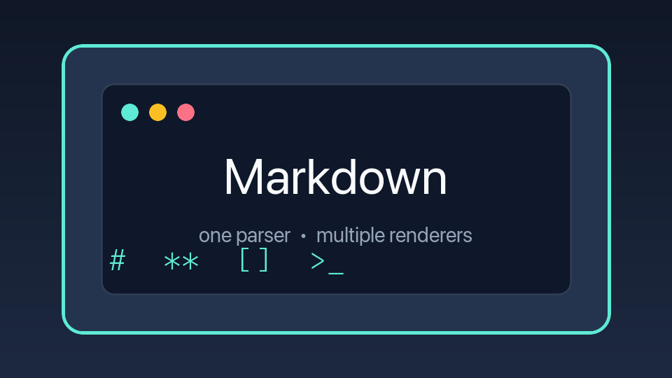

# Markdown concept gallery

This document exercises the supported Markdown parser features and its example renderers. Pass a file path on the command line to view another document.

## Headings

### Level three

#### Level four

##### Level five

###### Level six {level-six}

Setext level one
================

Setext level two
----------------

## Inline formatting

Plain text, *asterisk italic*, _underscore italic_, **asterisk bold**, __underscore bold__, ***asterisk bold italic***, ___underscore bold italic___, ~~struck text~~, ==highlighted text==, `inline code`, and :sparkles: emoji shortcode syntax.

The parser also recognizes __underline extension syntax__ when its underline option is enabled.

## Links and images

[A **formatted** link title](https://ziglang.org/ "Zig programming language") and .

## Block quotes

> A block quote can contain **formatted text**.
> Another quoted line follows it.
>> Nested block quote content.

## Lists

- Unordered item
- Another unordered item
  - Nested unordered item
    - Deeply nested item

1. First ordered item
2. Second ordered item
  1. Nested ordered item
  2. Another nested ordered item

- [x] Completed task
- [ ] Incomplete task

## Horizontal rules

---

***

___

## Code blocks

```zig
const std = @import("std");

pub fn main() void {
    std.debug.print("Hello, Markdown!\\n", .{});
}
```

```text
Fenced code can also omit language-specific highlighting.
Special Markdown characters stay literal here: **bold** [link](url)
```

## Tables

| Feature | Status | Notes |
| :--- | :---: | ---: |
| Headings | Supported | Six levels and custom IDs |
| Tables | Supported | Alignment and inline formatting |
| Escaped \| pipe | `a|b` | Pipes remain in their cells |
| Missing value | | Empty cells are padded |

## Unsupported syntax

Automatic URLs, subscript/superscript, alerts, footnotes, containers, HTML, escapes, and entities are currently preserved as ordinary source text rather than parsed as Markdown features.

## Final paragraph

The gallery ends with a normal paragraph containing **bold**, *italic*, `code`, a [link](https://example.com), and ~~strikethrough~~ together.
